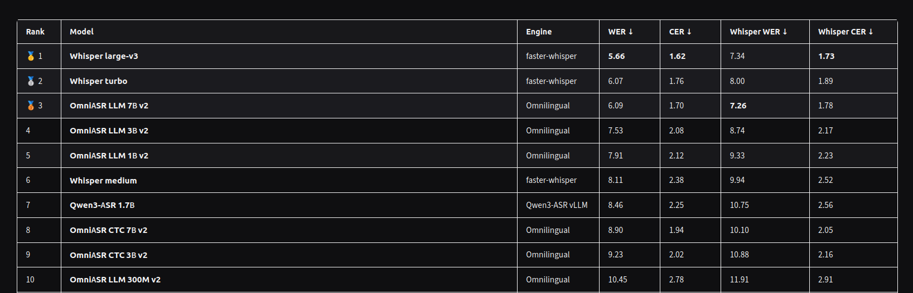

# Turkish ASR Model Evaluation

[](https://huggingface.co/spaces/EmreAkgul/Turkish-transcription-leaderboard)

[Open the live Turkish ASR leaderboard](https://huggingface.co/spaces/EmreAkgul/Turkish-transcription-leaderboard)

Evaluate ASR models with a common CLI:

```bash
./evaluate_model.py --engine <engine> --model <model> --dataset <dataset:split> [--device <device>] [--compute-type <type>] [--name <name>] [--workers <num_workers>]
```

Supported engines:

| Engine | Backend |
| --- | --- |
| `faster_whisper` | faster-whisper / CTranslate2 Whisper models |
| `omnilingual` | Meta Omnilingual ASR |
| `nemo` | NVIDIA NeMo ASR models |
| `qwen3_asr` | Qwen3-ASR transformers backend |

The `--dataset` value must be one of the supported dataset names plus a split:

```bash
./evaluate_model.py --engine faster_whisper --model small \
  --dataset fleurs:test
```

Supported datasets:

| Dataset | Hugging Face dataset | Config | Audio column | Reference column |
| --- | --- | --- | --- | --- |
| `fleurs` | `google/fleurs` | `tr_tr` | `audio` | `transcription` |
| `common_voice` | `fixie-ai/common_voice_17_0` | `tr` | `audio` | `sentence` |

Outputs are written to `results/<run_name>.jsonl`, and summary metrics are written to `results/<run_name>.summary.json`. Before scoring, non-spoken ASR control tokens such as `<tr-TR>` are removed and decomposed Turkish `i̇` is canonicalized. Primary scoring then applies NFC normalization, Turkish lowercasing, punctuation/symbol removal, and whitespace collapsing. Summary WER and CER are corpus-level error rates on a 0-100 percentage scale; the per-row JSONL rates are utterance-level diagnostics. Auxiliary `whisper_wer` and `whisper_cer` fields use Whisper's multilingual `BasicTextNormalizer` and do not replace the primary metrics.

Datasets are loaded in streaming mode so the CLI does not materialize the full dataset before evaluation.

Common Voice example:

```bash
./evaluate_model.py --engine faster_whisper --model small \
  --dataset common_voice:validation
```

`faster_whisper` defaults to CPU int8:

```bash
./evaluate_model.py --engine faster_whisper --model small --dataset fleurs:test
```

Use CUDA explicitly:

```bash
./evaluate_model.py --engine faster_whisper --model small --dataset fleurs:test \
  --device cuda --compute-type float16
```

Nemotron 3.5 ASR Turkish example:

```bash
./evaluate_model.py --engine nemo \
  --model nvidia/nemotron-3.5-asr-streaming-0.6b \
  --dataset fleurs:test \
  --name nemotron-3.5-asr-streaming-0.6b-fleurs-test
```

Omnilingual ASR examples:

```bash
./evaluate_model.py --engine omnilingual \
  --model omniASR_CTC_300M \
  --dataset fleurs:test \
  --name omniASR_CTC_300M-fleurs-test
```

```bash
./evaluate_model.py --engine omnilingual \
  --model omniASR_LLM_300M_v2 \
  --dataset fleurs:test \
  --name omniASR_LLM_300M_v2-fleurs-test
```

Qwen3-ASR examples:

```bash
./evaluate_model.py --engine qwen3_asr \
  --model Qwen/Qwen3-ASR-0.6B \
  --dataset fleurs:test \
  --device cuda
```

```bash
./evaluate_model.py --engine qwen3_asr \
  --model Qwen/Qwen3-ASR-1.7B \
  --dataset fleurs:test \
  --device cuda
```

## Installation

Recommended reproducible install with `uv`:

```bash
uv sync --extra all --group dev
```

Install only one backend:

```bash
uv sync --extra faster-whisper --group dev
uv sync --extra omnilingual --group dev
uv sync --extra nemo --group dev
```

Qwen3-ASR currently needs its own environment because its dependency stack
conflicts with the pinned NeMo/Omnilingual environment:

```bash
python3.10 -m venv .venv-qwen3-asr
.venv-qwen3-asr/bin/pip install torch==2.8.0
.venv-qwen3-asr/bin/pip install -e ".[dev]" qwen-asr==0.0.6
.venv-qwen3-asr/bin/python ./evaluate_model.py --engine qwen3_asr \
  --model Qwen/Qwen3-ASR-0.6B --dataset fleurs:test --device cuda
```

Run commands inside the locked environment:

```bash
uv run pytest
uv run ./evaluate_model.py --engine faster_whisper --model small --dataset fleurs:test
uv run ./scripts/run_all_evaluations.py
```

## Reproduce Benchmark Runs

Set up the locked environment:

```bash
uv sync --extra all --group dev
```

Verify the code path:

```bash
uv run pytest
```

Preview the exact benchmark commands without running models:

```bash
uv run ./scripts/run_all_evaluations.py --dry-run --datasets fleurs:test
uv run ./scripts/run_all_evaluations.py --dry-run --datasets common_voice:test --limit 2000
```

Run the benchmark protocol:

```bash
uv run ./scripts/run_all_evaluations.py --datasets fleurs:test
uv run ./scripts/run_all_evaluations.py --datasets common_voice:test --limit 2000
```

This evaluates all configured models on the full Turkish FLEURS test split and
the first 2000 samples of the Turkish Common Voice test split. Outputs are
written to `results/<run_name>.jsonl` and
`results/<run_name>.summary.json`. Existing summary files are skipped unless
`--force` is passed.

Pip install is still supported. Base install:

```bash
pip install -e .
```

Install one backend:

```bash
pip install -e ".[faster-whisper]"
pip install -e ".[omnilingual]"
pip install -e ".[nemo]"
pip install -e ".[dev]"
```

Combined install:

```bash
pip install -e ".[all,dev]"
```

If editable install fails with an old `pip`, upgrade packaging tools once:

```bash
python3 -m pip install --user --upgrade pip setuptools wheel
```

The NeMo extra is pinned to a Git commit that supports
`nvidia/nemotron-3.5-asr-streaming-0.6b`.

The Omnilingual engine also accepts the official checkpoint URLs:

```bash
./evaluate_model.py --engine omnilingual \
  --model https://dl.fbaipublicfiles.com/mms/omniASR-CTC-300M.pt \
  --dataset fleurs:test
```

Run the default full matrix sequentially:

```bash
uv run ./scripts/run_all_evaluations.py
```

The script evaluates every configured model on `fleurs:test` and
`common_voice:test`, skips jobs that already have a summary file, and continues
past individual failures. Preview commands without running models:

```bash
uv run ./scripts/run_all_evaluations.py --dry-run
```

## Development

```bash
uv sync --group dev
uv run pytest
```
